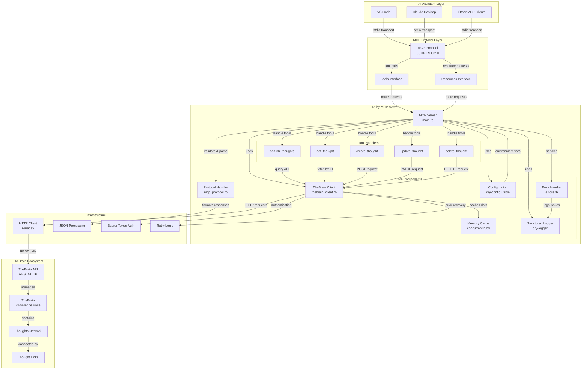

# TheBrain MCP Server (Ruby)

A Ruby implementation of a Model Context Protocol (MCP) server for TheBrain integration, enabling AI assistants to interact with your personal knowledge management system.

## Features

* **Search Thoughts**: Find thoughts using natural language queries
* **CRUD Operations**: Create, read, update, and delete thoughts
* **Relationship Management**: Handle parent-child thought relationships
* **Resource Access**: Browse thoughts as MCP resources
* **Type Safety**: Comprehensive error handling and validation
* **Performance**: Caching and rate limiting for optimal API usage
* **Well Tested**: Complete test suite with RSpec

## Architecture

The TheBrain MCP Server follows a modular architecture that bridges AI assistants with TheBrain's knowledge management system through the Model Context Protocol.



### Architecture Compliance

This implementation is **fully compliant** with the vision outlined in the [blog post](https://enogrob.github.io/thebrain/mcp/2025/05/15/thebrain-mcp-server.html). Key alignments:

* **Central Hub Design**: The MCP Server acts as the central hub between AI assistants and TheBrain  
* **Dynamic Knowledge Access**: LLMs can query and fetch data effortlessly through MCP tools  
* **Interactive Integration**: Transforms TheBrain from passive storage to active knowledge assistant  
* **Bidirectional Communication**: Supports both reading from and writing to TheBrain  
* **Extensible Architecture**: Modular design allows for future enhancements and integrations  

The Ruby implementation provides the robust foundation described in the blog post, enabling TheBrain to "think with you" rather than just being a static knowledge repository.


**Built in Ruby**

*Connecting AI assistants with personal knowledge management*

## Requirements

- Ruby 3.1 or higher
- TheBrain account with API access
- API key and Brain ID from TheBrain

## Installation

1. **Clone the repository:**
   ```bash
   git clone git@github.com:enogrob/project-thebrain-mcp-server.git
   cd project-thebrain-mcp-server
   ```

2. **Install dependencies:**
   ```bash
   bundle install
   ```

3. **Configure environment:**
   ```bash
   cp .env.example .env
   # Edit .env with your TheBrain API credentials
   ```

## Configuration

Create a `.env` file with your TheBrain API configuration:

```env
THEBRAIN_API_URL=https://api.thebrain.com
THEBRAIN_API_KEY=your_api_key_here
THEBRAIN_BRAIN_ID=your_brain_id_here
LOG_LEVEL=info
TIMEOUT=30
```

### Getting TheBrain Credentials

1. Visit [TheBrain API Documentation](https://help.thebrain.com/tutorials/thebrain-api/)
2. Generate an API key from your TheBrain account
3. Find your Brain ID in the TheBrain application settings

## Usage

### Development Mode

```bash
ruby bin/thebrain-mcp-server
```

### Production Mode

```bash
bundle exec ruby bin/thebrain-mcp-server
```

### Using with MCP Clients

Configure your MCP client (like Claude Desktop) to use this server:

```json
{
  "mcpServers": {
    "thebrain-ruby": {
      "command": "ruby",
      "args": ["/path/to/thebrain-mcp-server-ruby/bin/thebrain-mcp-server"],
      "env": {
        "THEBRAIN_API_KEY": "your_api_key",
        "THEBRAIN_BRAIN_ID": "your_brain_id"
      }
    }
  }
}
```

## Available Tools

| Tool | Description | Parameters |
|------|-------------|------------|
| `search_thoughts` | Search thoughts by query | `query` (required), `limit` (optional) |
| `get_thought` | Get specific thought by ID | `thought_id` (required) |
| `create_thought` | Create new thought | `name` (required), `notes`, `parent_id` |
| `update_thought` | Update existing thought | `thought_id` (required), `name`, `notes` |
| `delete_thought` | Delete thought | `thought_id` (required) |

## Resources

All thoughts are accessible as MCP resources with the URI pattern:
`thebrain://thought/{thought_id}`

Resources return Markdown-formatted content including:
- Thought name and notes
- Linked thoughts
- Creation/modification timestamps

## Testing

Run the test suite:

```bash
bundle exec rspec
```

Run with coverage:

```bash
bundle exec rspec --format documentation
```

## Project Structure

```
├── lib/
│   └── thebrain_mcp_server/
│       ├── thebrain_client.rb    # TheBrain API client
│       ├── mcp_protocol.rb       # MCP protocol implementation
│       ├── server.rb             # Main MCP server
│       ├── errors.rb             # Error classes
│       └── version.rb            # Version information
├── spec/                         # Test files
├── bin/thebrain-mcp-server      # Executable script
├── Gemfile                      # Dependencies
└── README.md                    # This file
```

## Development

### Code Quality

```bash
# Run RuboCop
bundle exec rubocop

# Auto-fix issues
bundle exec rubocop -a

# Generate documentation
bundle exec yard doc
```

### Debugging

Use `pry` for debugging:

```ruby
require 'pry'
binding.pry  # Add this line anywhere in the code
```

## 📖 API Reference

### TheBrain Client

```ruby
client = ThebrainMcpServer::ThebrainClient.new(
  base_url: 'https://api.thebrain.com',
  api_key: 'your-api-key',
  brain_id: 'your-brain-id'
)

# Search thoughts
results = client.search_thoughts('artificial intelligence', limit: 10)

# Get specific thought
thought = client.get_thought('thought-id')

# Create thought
new_thought = client.create_thought(
  name: 'New Idea',
  notes: 'Detailed notes about the idea'
)

# Update thought
updated = client.update_thought('thought-id', notes: 'Updated notes')

# Delete thought
client.delete_thought('thought-id')
```

### MCP Server

```ruby
# Start server with custom configuration
server = ThebrainMcpServer::Server.new
server.start
```

## Contributing

1. Fork the repository
2. Create a feature branch: `git checkout -b feature/amazing-feature`
3. Write tests for your changes
4. Ensure all tests pass: `bundle exec rspec`
5. Check code style: `bundle exec rubocop`
6. Commit your changes: `git commit -m 'Add amazing feature'`
7. Push to the branch: `git push origin feature/amazing-feature`
8. Open a Pull Request

## License

This project is licensed under the MIT License - see the LICENSE file for details.

## Acknowledgments

- [TheBrain Technologies](https://www.thebrain.com) for the knowledge management platform
- [Anthropic](https://www.anthropic.com) for the Model Context Protocol specification
- The Ruby community for excellent gems and tools

## Troubleshooting

### Common Issues

1. **Authentication Errors**
   - Verify your API key is correct
   - Check that your Brain ID is valid
   - Ensure your TheBrain account has API access

2. **Connection Issues**
   - Check your internet connection
   - Verify TheBrain API is accessible
   - Review timeout settings

3. **Installation Problems**
   - Ensure Ruby 3.1+ is installed
   - Try `bundle update` if dependencies conflict
   - Check for missing system libraries

### Debug Mode

Enable debug logging:

```bash
LOG_LEVEL=debug ruby bin/thebrain-mcp-server
```
