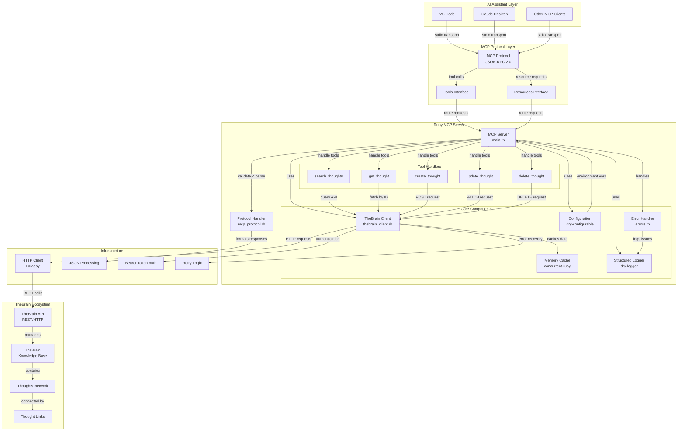
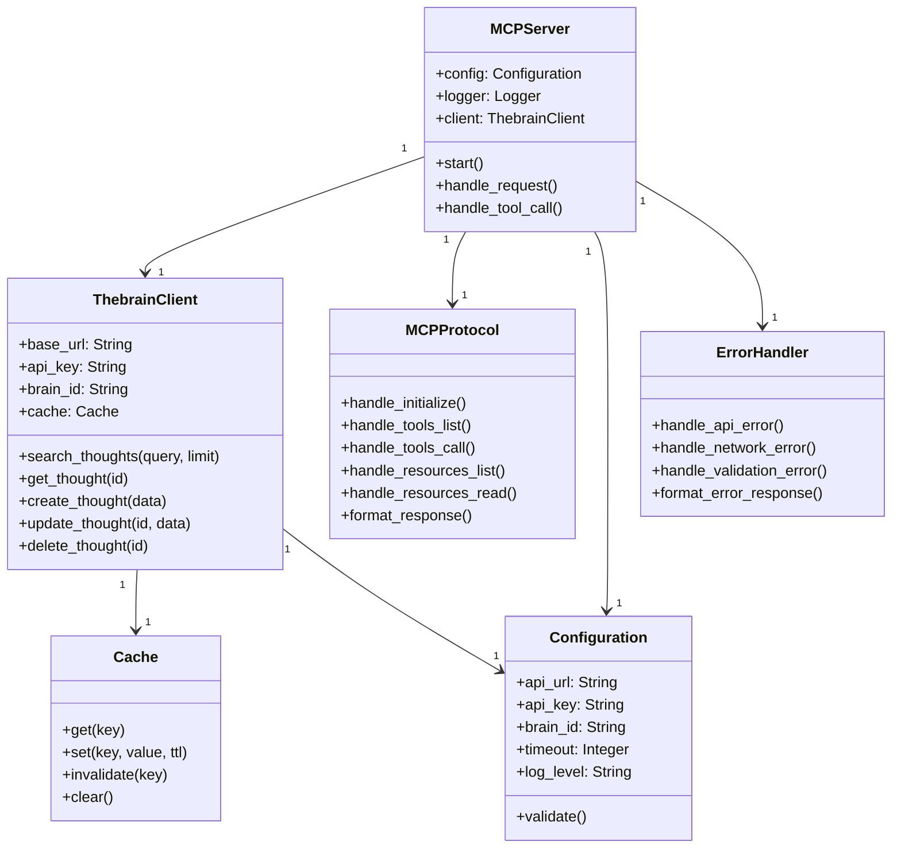
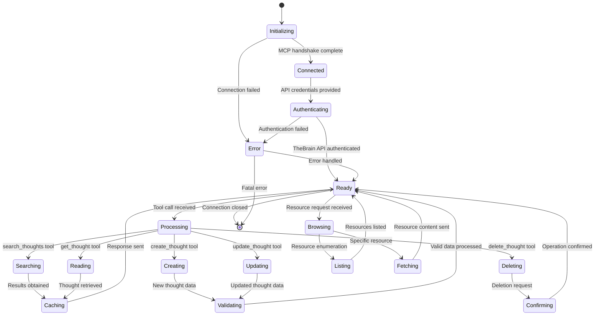
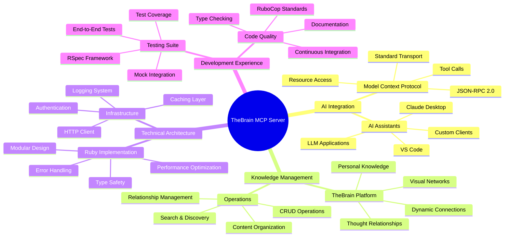

# **Project TheBrain MCP Server**

[Homepage](https://github.com/enogrob/ruby-thebrain-mcp-server)


## Contents

- [Summary](#summary)
- [Architecture](#architecture)
  - [Key Concepts](#key-concepts)
- [Tech Stack](#tech-stack)
- [Getting Started](#getting-started)
- [Usage Examples](#usage-examples)
- [Contributing Guidelines](#contributing-guidelines)
- [Troubleshooting](#troubleshooting)
- [License](#license)
- [References](#references)

### Summary

The TheBrain MCP Server is a Ruby implementation of a Model Context Protocol (MCP) server that bridges AI assistants with TheBrain's knowledge management system. This innovative project transforms TheBrain from a passive knowledge repository into an active, AI-accessible knowledge assistant that can "think with you" rather than just store information.

TheBrain is a powerful visual knowledge management platform trusted by major organizations including Boeing, Microsoft, Google, Apple, and Harvard University. It enables users to create dynamic, interconnected networks of thoughts, files, and ideas that mirror natural thinking patterns. The MCP Server project extends TheBrain's capabilities by providing AI assistants like Claude Desktop, VS Code, and other MCP clients with seamless access to your personal knowledge base through standardized tools and resources.

This project represents a significant step forward in making personal knowledge management systems truly intelligent and interactive. By implementing the Model Context Protocol specification, it enables bidirectional communication between AI models and TheBrain, allowing for sophisticated operations like semantic search, thought creation, relationship management, and content analysis. The server's modular Ruby architecture ensures reliability, performance, and extensibility while maintaining the security and privacy standards expected for personal knowledge management systems.

### Architecture

The TheBrain MCP Server implements a sophisticated multi-layered architecture that seamlessly connects AI assistants with TheBrain's knowledge management ecosystem through the standardized Model Context Protocol.



<details>
<summary><strong>1. Class Diagram - Structural Relationships</strong> (Click to expand)</summary>



</details>

<details>
<summary><strong>2. Journey Process - State Transitions</strong> (Click to expand)</summary>



</details>

<details>
<summary><strong>3. Mind Map - Interconnected Themes</strong> (Click to expand)</summary>



</details>

#### Key Concepts

* **Model Context Protocol (MCP)**: An open protocol that standardizes how applications provide context to LLMs, enabling AI assistants to access external data sources and tools through a unified interface
* **TheBrain**: A visual knowledge management platform that enables users to create dynamic, interconnected networks of thoughts, files, and ideas that mirror natural thinking patterns
* **Thought Networks**: The core organizational structure in TheBrain where individual thoughts (concepts, ideas, files) are connected through meaningful relationships and associations
* **JSON-RPC 2.0**: The communication protocol used by MCP for message exchange between clients and servers, providing standardized request-response patterns
* **Tool Handlers**: Specialized Ruby methods that implement specific MCP tools (search, create, update, delete) and translate them into TheBrain API operations
* **Resource Interface**: MCP's mechanism for exposing TheBrain thoughts as accessible resources with standardized URIs and content formatting
* **Bearer Token Authentication**: Security mechanism used to authenticate with TheBrain's REST API using API keys for secure access to personal knowledge bases
* **Concurrent Caching**: In-memory caching system using Ruby's concurrent-ruby gem to optimize API performance and reduce redundant requests to TheBrain
* **Stdio Transport**: The communication channel used by MCP clients to interact with the server through standard input/output streams
* **Thought Relationships**: The parent-child and associative connections between thoughts in TheBrain that create the knowledge network structure

### Tech Stack

* **Programming Language**: Ruby 3.1+ - Modern Ruby version with enhanced performance and language features
* **Framework**: Model Context Protocol (MCP) - Open protocol for AI-context integration developed by Anthropic
* **Libraries/Dependencies**: 
  - `faraday` (~> 2.7) - HTTP client library for REST API communication with TheBrain
  - `faraday-retry` (~> 2.2) - Automatic retry logic for resilient API connections
  - `concurrent-ruby` (~> 1.2) - Thread-safe data structures and concurrent programming utilities
  - `dry-configurable` (~> 1.1) - Configuration management with validation and type safety
  - `dry-logger` (~> 1.0) - Structured logging with multiple output formats
  - `zeitwerk` (~> 2.6) - Code loading and autoloading management
  - `json` (~> 2.6) - JSON parsing and serialization for MCP protocol communication
* **Testing Framework**: 
  - `rspec` (~> 3.12) - Behavior-driven development testing framework
  - `rspec-json_expectations` (~> 2.2) - JSON response testing utilities
  - `vcr` (~> 6.2) - HTTP interaction recording for reliable API testing
  - `webmock` (~> 3.19) - HTTP request stubbing and mocking
  - `simplecov` (~> 0.22) - Code coverage analysis and reporting
* **Build Tools**: 
  - `bundler` - Dependency management and gem installation
  - `zeitwerk` - Automatic code loading and module organization
* **Development Tools**: 
  - `rubocop` (~> 1.57) - Ruby code style enforcement and linting
  - `rubocop-rspec` (~> 2.25) - RSpec-specific RuboCop rules
  - `pry` (~> 0.14) - Interactive debugging and REPL
  - `pry-byebug` (~> 3.10) - Enhanced debugging with breakpoints
  - `solargraph` (~> 0.49) - Language server for IDE integration
  - `yard` (~> 0.9) - Documentation generation from code comments
* **Deployment**: Standalone Ruby application with stdio transport for MCP client integration
* **Documentation**: YARD for API documentation, Markdown for user guides
* **Version Control**: Git with structured branching and conventional commits
* **Environment Management**: dotenv for secure configuration management

### Getting Started

#### Prerequisites

- Ruby 3.1 or higher installed on your system
- TheBrain account with API access enabled
- API key and Brain ID from your TheBrain account

#### Installation

1. **Clone the repository:**
   ```bash
   git clone https://github.com/enogrob/ruby-thebrain-mcp-server.git
   cd ruby-thebrain-mcp-server
   ```

2. **Install dependencies:**
   ```bash
   bundle install
   ```

3. **Configure environment variables:**
   ```bash
   cp .env.example .env
   # Edit .env with your TheBrain API credentials
   ```

4. **Set up your TheBrain credentials in `.env`:**
   ```env
   THEBRAIN_API_URL=https://api.thebrain.com
   THEBRAIN_API_KEY=your_api_key_here
   THEBRAIN_BRAIN_ID=your_brain_id_here
   LOG_LEVEL=info
   TIMEOUT=30
   ```

#### Getting TheBrain API Credentials

1. Open your TheBrain application
2. Navigate to **File > Preferences > API** (or **TheBrain > Preferences > API** on macOS)
3. Enable API access and generate an API key
4. Copy your Brain ID from the application settings
5. Note: API access may require a TheBrain Pro or Team subscription

#### Verification

Test your installation and configuration:

```bash
# Test the server configuration
ruby bin/thebrain-mcp-server --test

# Run the test suite to verify everything works
bundle exec rspec
```

### Usage Examples

#### Basic MCP Client Configuration

Configure your MCP client (such as Claude Desktop) to use the TheBrain MCP Server:

```json
{
  "mcpServers": {
    "thebrain-ruby": {
      "command": "ruby",
      "args": ["/path/to/thebrain-mcp-server-ruby/bin/thebrain-mcp-server"],
      "env": {
        "THEBRAIN_API_KEY": "your_api_key",
        "THEBRAIN_BRAIN_ID": "your_brain_id"
      }
    }
  }
}
```

#### Tool Usage Examples

**1. Search for thoughts:**
```bash
# Example MCP tool call from an AI assistant
{
  "method": "tools/call",
  "params": {
    "name": "search_thoughts",
    "arguments": {
      "query": "artificial intelligence",
      "limit": 5
    }
  }
}
```

**2. Retrieve a specific thought:**
```bash
# Get detailed information about a thought
{
  "method": "tools/call",
  "params": {
    "name": "get_thought",
    "arguments": {
      "thought_id": "12345-abcde-67890"
    }
  }
}
```

**3. Create a new thought:**
```bash
# Create a new thought with notes
{
  "method": "tools/call",
  "params": {
    "name": "create_thought",
    "arguments": {
      "name": "Machine Learning Concepts",
      "notes": "Core concepts in ML including supervised, unsupervised, and reinforcement learning.",
      "parent_id": "ai-parent-thought-id"
    }
  }
}
```

**4. Update an existing thought:**
```bash
# Update thought content
{
  "method": "tools/call",
  "params": {
    "name": "update_thought",
    "arguments": {
      "thought_id": "12345-abcde-67890",
      "notes": "Updated notes with new insights about neural networks."
    }
  }
}
```

#### Resource Access Examples

**Access thoughts as MCP resources:**
```bash
# List available thought resources
{
  "method": "resources/list"
}

# Read specific thought resource
{
  "method": "resources/read",
  "params": {
    "uri": "thebrain://thought/12345-abcde-67890"
  }
}
```

#### Programming API Examples

**Using the TheBrain client directly in Ruby:**
```ruby
require 'thebrain_mcp_server'

# Initialize client
client = ThebrainMcpServer::ThebrainClient.new(
  base_url: 'https://api.thebrain.com',
  api_key: ENV['THEBRAIN_API_KEY'],
  brain_id: ENV['THEBRAIN_BRAIN_ID']
)

# Search for thoughts
results = client.search_thoughts('project ideas', limit: 10)
puts "Found #{results.length} thoughts"

# Create a new thought
new_thought = client.create_thought(
  name: 'Ruby MCP Integration',
  notes: 'Implementation details for MCP server'
)

# Get thought details
thought = client.get_thought(new_thought['id'])
puts "Thought: #{thought['name']}"
puts "Notes: #{thought['notes']}"
```

### Contributing Guidelines

We welcome contributions to the TheBrain MCP Server project! Here's how you can help improve this Ruby implementation:

#### Development Setup

1. **Fork and clone the repository:**
   ```bash
   git clone https://github.com/your-username/ruby-thebrain-mcp-server.git
   cd ruby-thebrain-mcp-server
   ```

2. **Set up development environment:**
   ```bash
   bundle install
   cp .env.example .env
   # Configure your test TheBrain credentials
   ```

3. **Run tests to ensure everything works:**
   ```bash
   bundle exec rspec
   ```

#### Development Workflow

1. **Create a feature branch:**
   ```bash
   git checkout -b feature/your-feature-name
   ```

2. **Write tests for your changes:**
   - Add unit tests in `spec/` directory
   - Follow existing test patterns and naming conventions
   - Ensure test coverage remains high

3. **Implement your feature:**
   - Follow Ruby style guide and project conventions
   - Add appropriate documentation and comments
   - Update README if adding new features

4. **Run quality checks:**
   ```bash
   # Run tests
   bundle exec rspec
   
   # Check code style
   bundle exec rubocop
   
   # Auto-fix style issues where possible
   bundle exec rubocop -a
   ```

5. **Commit and push:**
   ```bash
   git add .
   git commit -m "Add feature: brief description"
   git push origin feature/your-feature-name
   ```

6. **Create a Pull Request:**
   - Describe your changes clearly
   - Reference any related issues
   - Ensure all CI checks pass

#### Coding Standards

- **Ruby Style**: Follow RuboCop configuration in `.rubocop.yml`
- **Testing**: Maintain 100% test coverage with RSpec
- **Documentation**: Add YARD comments for new public methods
- **Commits**: Use conventional commit messages
- **Dependencies**: Keep gems up to date and justify new dependencies

#### Reporting Issues

- Use GitHub Issues for bug reports and feature requests
- Include Ruby version, gem versions, and error messages
- Provide minimal reproduction steps
- Search existing issues before creating new ones

### Troubleshooting

#### Common Issues

**1. Authentication Errors**

*Problem*: `401 Unauthorized` or `403 Forbidden` responses from TheBrain API

*Solutions*:
- Verify your API key is correct and hasn't expired
- Check that your Brain ID matches your TheBrain account
- Ensure your TheBrain account has API access enabled (may require Pro/Team subscription)
- Test API credentials directly with curl:
  ```bash
  curl -H "Authorization: Bearer YOUR_API_KEY" \
       "https://api.thebrain.com/v1/brains/YOUR_BRAIN_ID/thoughts"
  ```

**2. Connection Issues**

*Problem*: Network timeouts or connection refused errors

*Solutions*:
- Check your internet connection and firewall settings
- Verify TheBrain API service status
- Increase timeout values in your `.env` file:
  ```env
  TIMEOUT=60
  ```
- Test connectivity:
  ```bash
  curl -I https://api.thebrain.com
  ```

**3. Installation Problems**

*Problem*: Bundle install fails or gem conflicts

*Solutions*:
- Ensure Ruby 3.1+ is installed: `ruby --version`
- Update bundler: `gem install bundler`
- Clear gem cache: `bundle exec gem cleanup`
- Try fresh bundle install:
  ```bash
  rm Gemfile.lock
  bundle install
  ```

**4. MCP Client Integration Issues**

*Problem*: Claude Desktop or other MCP clients can't connect to server

*Solutions*:
- Verify the server path in MCP client configuration
- Check that Ruby is in your system PATH
- Test server manually:
  ```bash
  echo '{"jsonrpc":"2.0","id":1,"method":"initialize","params":{}}' | ruby bin/thebrain-mcp-server
  ```
- Review MCP client logs for specific error messages

**5. Runtime Errors**

*Problem*: Server crashes or unexpected behavior

*Solutions*:
- Enable debug logging:
  ```env
  LOG_LEVEL=debug
  ```
- Check server logs for stack traces
- Verify environment variables are properly set
- Test with minimal configuration

#### Debug Mode

Enable comprehensive debugging:

```bash
# Set debug environment
export LOG_LEVEL=debug
export THEBRAIN_DEBUG=true

# Run server with verbose output
ruby bin/thebrain-mcp-server --debug
```

#### Getting Help

- **Documentation**: Check the project README and code comments
- **Issues**: Search GitHub Issues for similar problems
- **Community**: Start a GitHub Discussion for questions
- **Email**: Contact the maintainer at enogrob@gmail.com for urgent issues

### License

This project is licensed under the MIT License. The MIT License is a permissive open source license that allows for commercial and non-commercial use, modification, and distribution.

**Key permissions:**
- Commercial use
- Modification and distribution
- Private use

**Requirements:**
- Include original license text
- Include copyright notice

**Limitations:**
- No warranty provided
- No liability for damages

For the complete license text, see the [LICENSE](src/ruby-thebrain-mcp-server/LICENSE) file in the project repository.

### References

* [TheBrain MCP Server Ruby Repository](https://github.com/enogrob/ruby-thebrain-mcp-server) - Official Ruby implementation of the MCP server with complete source code, documentation, and examples
* [Model Context Protocol Specification](https://modelcontextprotocol.io/introduction) - Official MCP documentation covering protocol specification, client/server architecture, and implementation guidelines
* [TheBrain Official Website](https://www.thebrain.com/) - Comprehensive information about TheBrain knowledge management platform, features, pricing, and enterprise solutions
* [TheBrain API Documentation](https://www.thebrain.com/api) - Official API reference for TheBrain's REST endpoints, authentication, and data models (when available)
* [The Vision: Making TheBrain Smarter with MCP Server](https://enogrob.github.io/thebrain/mcp/2025/05/15/thebrain-mcp-server.html) - Original blog post outlining the architectural vision and goals for AI-powered knowledge management integration
* [Model Context Protocol GitHub Organization](https://github.com/modelcontextprotocol) - Open source MCP implementations, tools, and community contributions including SDKs and example servers
* [Anthropic MCP Documentation](https://docs.anthropic.com/claude/docs/mcp) - Claude-specific MCP integration guide and best practices for AI assistant development
* [Ruby Documentation](https://ruby-doc.org/) - Official Ruby language documentation covering syntax, standard library, and best practices for Ruby 3.1+
* [Faraday HTTP Client](https://lostisland.github.io/faraday/) - Documentation for the Ruby HTTP client library used for TheBrain API communication
* [RSpec Testing Framework](https://rspec.info/) - Comprehensive testing framework documentation and best practices for behavior-driven development
* [JSON-RPC 2.0 Specification](https://www.jsonrpc.org/specification) - Protocol specification used by MCP for client-server communication
* [Concurrent Ruby](https://github.com/ruby-concurrency/concurrent-ruby) - Thread-safe programming constructs and utilities used for caching and performance optimization
* [MCP Example Servers](https://modelcontextprotocol.io/examples) - Gallery of official and community MCP server implementations for reference and inspiration
* [TheBrain Knowledge Management Best Practices](https://www.thebrain.com/support) - Official guides and tutorials for effective knowledge organization and brain management

